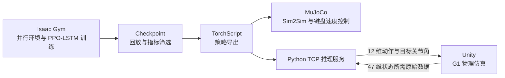

# Unitree G1 下肢强化学习与跨仿真部署

基于 **Isaac Gym + PPO-LSTM** 训练 Unitree G1 12 自由度下肢行走策略，并将 TorchScript 策略部署到 **MuJoCo** 与 **Unity**，完成从并行训练、检查点评估到跨仿真闭环控制的工程链路。

> 项目范围：当前只进行仿真训练与 Sim2Sim 验证，不包含真实机器人控制。

## 项目概览

本项目解决的核心问题不是“让模型输出一组关节角”这么简单，而是保证同一个策略在不同物理引擎中获得一致的观测、动作、控制频率和机器人参数。



| 模块 | 技术与职责 |
| --- | --- |
| 强化学习训练 | Isaac Gym、PyTorch、RSL-RL、PPO、LSTM、多环境并行采样 |
| 机器人控制 | 12-DoF 下肢、速度命令跟踪、关节 PD 控制、周期相位观测 |
| 策略评估 | TensorBoard、checkpoint 回放、奖励分项与动作稳定性分析 |
| MuJoCo 部署 | TorchScript 推理、Sim2Sim、方向键实时速度控制 |
| Unity 联调 | TCP/JSON Lines、50 Hz 推理服务、坐标系与物理参数对齐 |

## 我完成的工作

### 1. Isaac Gym 强化学习训练

- 跑通 G1 预训练策略、从零训练、指定 checkpoint 回放和 TorchScript 导出流程。
- 使用 12 个下肢关节作为动作空间，训练策略跟踪前进、横移和转向速度命令。
- 调整并验证默认关节姿态、髋/膝/踝关节 PD 参数、机身目标高度和训练迭代上限。
- 使用摩擦系数、机身质量和外部推力随机化，提高策略对物理参数变化的适应能力。
- 编写默认姿态诊断脚本，在不运行策略的情况下测试 PD 平衡并测量骨盆高度。
- 定位循环策略训练中“全部环境提前结束”导致的 trajectory/mask 长度不一致问题，并完成 RNN 轨迹补齐修复验证。

### 2. 训练结果分析与 checkpoint 筛选

- 通过 TensorBoard 联合观察 `mean_reward`、`mean_episode_length`、速度跟踪、姿态、机身高度、value loss 和策略噪声。
- 不以“训练轮数最多”作为唯一标准；通过中间 checkpoint 回放识别过度更新、策略退化和腿部高频摆动。
- 将训练 checkpoint 与部署模型分离：`model_*.pt` 用于恢复训练，`policy_lstm_*.pt` 用于独立推理。

### 3. MuJoCo Sim2Sim

- 在 MuJoCo 中加载 G1 XML、关节 PD 参数和 TorchScript 策略，验证训练策略的跨引擎表现。
- 新增键盘控制版本，将固定速度命令改为实时输入：方向键控制前后/左右，`Q`、`E` 控制转向，`Esc` 退出。
- 对齐关节顺序、默认角度、动作缩放和控制周期，保证动作按
  `target_q = default_q + action * action_scale` 执行。

### 4. Unity Sim2Sim 接口

- 设计 Python TCP 策略推理服务，接收 Unity 机器人状态并构造与训练一致的 47 维观测。
- 返回完整 12 维策略动作及目标关节角，而不是使用动作范数等调试统计量代替控制数据。
- 定义逐行 JSON 协议、请求序号、重置、心跳、配置查询、异常返回和 1 MiB 消息上限。
- 支持可配置的启动站立延时；等待期间返回 `hold`，延时结束后清空 LSTM 隐状态再开始闭环控制。
- 增加 RX/TX 日志、Mock Unity 客户端和观测构造单元测试，便于在没有 Unity 场景时验证协议。
- 整理 URDF 质量、惯量、关节轴、限位、力矩、速度、摩擦和 PD 参数，供 Unity `ArticulationBody` 参数对齐。

## 控制接口

策略每 20 ms 推理一次，即 **50 Hz**。Isaac Gym 物理步长为 5 ms，每 4 个物理步执行一次新动作。

### 47 维观测

```text
机身角速度 3
+ 投影重力 3
+ 速度命令 3
+ 关节位置偏差 12
+ 关节速度 12
+ 上一步动作 12
+ 步态相位 sin/cos 2
= 47
```

### 12 维动作

动作顺序固定为左右腿的：髋 pitch、髋 roll、髋 yaw、膝、踝 pitch、踝 roll。策略输出经过 `action_scale = 0.25` 缩放，再叠加默认关节角得到 PD 目标位置。

### Unity 请求与响应

Unity 每个策略周期发送一行 JSON：

```json
{
  "seq": 1,
  "sim_time": 0.02,
  "reset": false,
  "base_quaternion_wxyz": [1.0, 0.0, 0.0, 0.0],
  "base_angular_velocity": [0.0, 0.0, 0.0],
  "joint_position": [0.0, 0.0, 0.0, 0.0, 0.0, 0.0, 0.0, 0.0, 0.0, 0.0, 0.0, 0.0],
  "joint_velocity": [0.0, 0.0, 0.0, 0.0, 0.0, 0.0, 0.0, 0.0, 0.0, 0.0, 0.0, 0.0],
  "command": [0.3, 0.0, 0.0]
}
```

Python 返回同一 `seq` 对应的动作：

```json
{
  "type": "action",
  "seq": 1,
  "action": [0.0, 0.0, 0.0, 0.0, 0.0, 0.0, 0.0, 0.0, 0.0, 0.0, 0.0, 0.0],
  "target_joint_position": [0.0, 0.0, 0.0, 0.0, 0.0, 0.0, 0.0, 0.0, 0.0, 0.0, 0.0, 0.0],
  "command_used": [0.3, 0.0, 0.0],
  "inference_ms": 0.2
}
```

坐标约定为右手系 `x` 向前、`y` 向左、`z` 向上；四元数顺序为 `wxyz`；角度单位为弧度。

## 目录结构

```text
unitree/
├── rsl_rl/                                      PPO/LSTM 算法子模块
└── unitree_rl_gym-main/
    ├── legged_gym/envs/g1/                      G1 环境、奖励与训练配置
    ├── legged_gym/scripts/train.py               训练入口
    ├── legged_gym/scripts/play.py                checkpoint 回放与策略导出
    ├── legged_gym/scripts/test_default_pose.py   默认姿态与骨盆高度测试
    ├── deploy/deploy_mujoco/                     MuJoCo Sim2Sim
    │   └── deploy_mujoco_keyboard.py             键盘速度控制
    ├── deploy/deploy_unity/                      Unity 策略服务与参数文档
    │   ├── policy_server.py
    │   ├── mock_unity_client.py
    │   ├── test_policy_server.py
    │   └── configs/
    └── resources/robots/g1_description/          G1 URDF、MJCF 与网格资源
```

## 环境准备

建议使用 Ubuntu、NVIDIA GPU 和 Python 3.8。Isaac Gym Preview 4 需要从 NVIDIA 获取并在本机安装；其余依赖在同一个 Conda 环境中安装。

```bash
git clone --recurse-submodules https://github.com/xfang8343/unitree.git
cd unitree

conda create -n unitree-rl python=3.8 -y
conda activate unitree-rl

# 进入下载后的 Isaac Gym Python 目录
cd /path/to/isaacgym/python
pip install -e .

cd /path/to/unitree/rsl_rl
pip install -e .

cd /path/to/unitree/unitree_rl_gym-main/legged_gym
pip install -e .

pip install mujoco pynput pyyaml tensorboard
export LD_LIBRARY_PATH="$CONDA_PREFIX/lib:${LD_LIBRARY_PATH:-}"
```

本仓库为 RSL-RL 循环策略的极端提前终止问题保留了可复现补丁。首次克隆后在仓库根目录执行：

```bash
git -C rsl_rl apply --unidiff-zero ../patches/rsl_rl_recurrent_trajectory_padding.patch
```

更完整的 Isaac Gym 环境说明见 [安装文档](unitree_rl_gym-main/doc/setup_zh.md)。

## 快速运行

以下命令均在 `unitree_rl_gym-main/` 下执行。

### 1. 训练

```bash
python legged_gym/scripts/train.py \
  --task=g1 \
  --headless \
  --num_envs=128 \
  --max_iterations=15000
```

训练输出保存在 `logs/g1/<run>/`。训练规模应根据显存调整；正式实验前可先用较少环境和迭代验证链路。

### 2. 查看曲线

```bash
tensorboard --logdir logs/g1 --port 6006
```

浏览器访问 `http://127.0.0.1:6006`。筛选模型时同时检查奖励、episode 长度、速度跟踪、姿态稳定性和回放表现。

### 3. 回放并导出指定 checkpoint

```bash
python legged_gym/scripts/play.py \
  --task=g1 \
  --load_run=<run目录名> \
  --checkpoint=<迭代编号> \
  --num_envs=1
```

导出的 TorchScript 位于 `logs/g1/exported/policies/`。切换 checkpoint 后应给导出文件增加可追踪的名称，避免覆盖后无法确认模型来源。训练日志与个人 checkpoint 体积较大，不纳入仓库。

### 4. MuJoCo 回放与键盘控制

```bash
# 固定速度命令
python deploy/deploy_mujoco/deploy_mujoco.py g1.yaml

# 实时键盘命令
python deploy/deploy_mujoco/deploy_mujoco_keyboard.py g1.yaml
```

键盘模式使用方向键控制前后和左右，`Q` / `E` 控制原地转向，`Esc` 结束。

### 5. Unity 策略服务

先启动服务：

```bash
python deploy/deploy_unity/policy_server.py \
  --host 0.0.0.0 \
  --port 9002 \
  --policy /path/to/policy_lstm.pt \
  --startup-delay 5 \
  --print-messages \
  --print-every 10
```

`0.0.0.0` 表示监听 Python 电脑的所有网卡；另一台电脑上的 Unity 应连接 Python 电脑的局域网 IP 和端口 `9002`。

不启动 Unity 也可测试完整请求/响应：

```bash
python deploy/deploy_unity/mock_unity_client.py \
  --host 127.0.0.1 \
  --port 9002 \
  --steps 300 \
  --command 0.3 0.0 0.0
```

Unity 物理参数和坐标转换说明见 [G1 Unity 参数对齐文档](unitree_rl_gym-main/deploy/deploy_unity/G1_UNITY_PHYSICS_SETUP.md)，服务端完整说明见 [Unity 策略服务文档](unitree_rl_gym-main/deploy/deploy_unity/README.md)。

## 验证状态

| 链路 | 状态 |
| --- | --- |
| Isaac Gym 预训练模型回放 | 已跑通 |
| G1 PPO-LSTM 从零训练、checkpoint 保存与回放 | 已跑通 |
| TorchScript 策略导出 | 已跑通 |
| MuJoCo 预训练/自训练策略 Sim2Sim | 已跑通 |
| MuJoCo 键盘速度命令控制 | 已实现 |
| Python 与 Unity TCP 双向 JSON 通信 | 已完成联调测试 |
| Unity 47 维观测构造与 12 维动作返回 | 已实现并有单元测试 |
| Unity 复杂场景稳定行走与避障 | 后续工作 |
| 真实机器人部署 | 不在当前项目范围 |

## 工程认识

- 强化学习的最后一个 checkpoint 不一定最好。PPO 仍在持续更新，后期可能因随机采样、价值估计偏差或探索噪声出现策略退化，因此应保存并回放多个 checkpoint。
- Sim2Sim 的关键是接口一致性。关节顺序、方向、默认角、坐标系、四元数顺序、PD 增益、动作缩放和控制频率中任何一项不一致，都可能使 Isaac Gym 中可行的策略在 Unity 中立即失稳。
- Python 服务并不直接“扶住”Unity 中的机器人。它输出关节目标，Unity 必须正确实现刚体、碰撞、关节 Drive 和固定频率闭环，二者共同形成完整控制系统。

## 后续计划

- 完成 Unity 平地站立、速度跟踪和 MuJoCo/Isaac Gym/Unity 三端参数误差对比。
- 增加状态与动作录制工具，量化关节跟踪误差、控制延迟、机身姿态和足端接触差异。
- 在基础行走策略之上研究高度图/深度感知、复杂地形课程学习和目标点导航。

## 项目来源

本项目基于 [Unitree Robotics unitree_rl_gym](https://github.com/unitreerobotics/unitree_rl_gym) 进行学习、配置实验与跨仿真扩展。仓库中的自定义工作主要集中在 G1 训练调参与诊断、MuJoCo 键盘控制、Unity 策略服务、通信协议和物理参数对齐。
